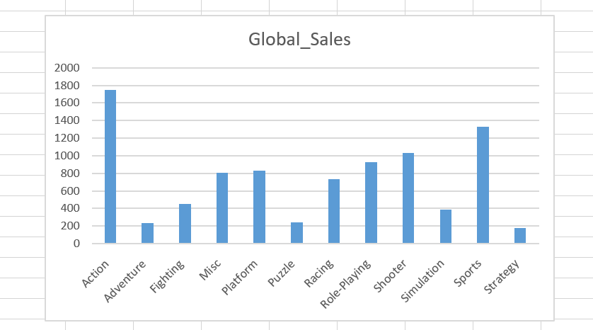
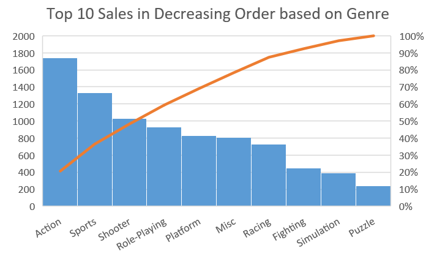

# vineethabatchu-piping-map-reduce

[link to dataset](https://www.kaggle.com/arslanali4343/sales-of-video-games)

## About Data
This dataset contains a list of video games with sales greater than 100,000 copies. It was generated by a scrape of vgchartz.com.
Fields include

Rank - Ranking of overall sales

Name - The games name

Platform - Platform of the games release (i.e. PC,PS4, etc.)

Year - Year of the game's release

Genre - Genre of the game

Publisher - Publisher of the game

NA_Sales - Sales in North America (in millions)

EU_Sales - Sales in Europe (in millions)

JP_Sales - Sales in Japan (in millions)

Other_Sales - Sales in the rest of the world (in millions)

Global_Sales - Total worldwide sales.

## Data
I have processed data with 11493 values to data which shows different Genre's and Global Sales of the Video Games.

## Chart1 Findings:
This chart shows the sales Globally in various genre's.

## Chart2 Findings
Among the 10 Genre's, Action has the most sales and puzzle has least sales.

## Instructions to Execute
cat vgsales.csv | python mapper.py | sort | python reducer.py > batchu.txt
